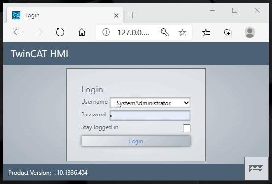

# Example TcHmi User Switching

## Disclaimer
This is a personal guide not a peer reviewed journal or a sponsored publication. We make
no representations as to accuracy, completeness, correctness, suitability, or validity of any
information and will not be liable for any errors, omissions, or delays in this information or any
losses injuries, or damages arising from its display or use. All information is provided on an as
is basis. It is the reader’s responsibility to verify their own facts.

The views and opinions expressed in this guide are those of the authors and do not
necessarily reflect the official policy or position of any other agency, organization, employer or
company. Assumptions made in the analysis are not reflective of the position of any entity
other than the author(s) and, since we are critically thinking human beings, these views are
always subject to change, revision, and rethinking at any time. Please do not hold us to them
in perpetuity.

## Overview
Super simple worked example of swapping users.  This function block requies parameters of the known username and password. This could be used as an alternative to Logout when you need to logout to a base "minimal" user level. 

### Example of quick user switching.



```javascript
(function (TcHmi) {

    var LoginUser = function (UserName,Password,StayLoggedIn,ReloadPage) {

        if (TcHmi.Server.isWebsocketReady()) {
            var request = {
                "requestType": "ReadWrite",
                "commands": [
                    {
                        "commandOptions": ["SendErrorMessage", "SendWriteValue"],
                        "symbol": "Login",
                        "writeValue":
                        {
                            "userName": UserName,
                            "password": Password,
                            "persistent": StayLoggedIn
                        }
                    }
                ]
            };

            // Send request to TwinCAT HMI Server.
            TcHmi.Server.request(request, function (data) {
                // Callback handling.
                if (data.error !== TcHmi.Errors.NONE) {
                    // Handle TcHmi.Server class level error here.
                    return;
                }
                var response = data.response;
                if (response.error !== undefined) {
                    // Handle TwinCAT HMI Server response level error here.
                    return;
                }
                var commands = response.commands;
                if (commands === undefined) {
                    return;
                }
                for (var i = 0, ii = commands.length; i < ii; i++) {
                    var command = response.commands[i];
                    if (command === undefined) {
                        return;
                    }
                    if (command.error !== undefined) {
                        // Handle TwinCAT HMI Server command level error here.
                        return;
                    }
                    // Handle result...
                    if (command.symbol = "Login") {

                        if (StayLoggedIn) {
                            // Remember the current session for 30 days
                            document.cookie = "sessionId=" + command.readValue + ";path=/;max-age=" + 60 * 60 * 24 * 30;
                        } else {
                            // Reset max-age
                            document.cookie = "sessionId=" + command.readValue + ";path=/";
                        }

                        if (ReloadPage) {
                            // login was successful, load base url
                            if (window.location.href.indexOf("Login") != -1) {
                                window.location.href = window.location.href.replace(/Login.*?\//, '');
                            }
                            else {
                                window.location.reload();
                            }
                        }
                    }
                }
            });
        }
    };
    
    TcHmi.Functions.registerFunction('LoginUser', LoginUser);
})(TcHmi);
```

## Install 
Not required.  Simply open the project.

## TwinCAT
This project uses TcXaeShell 3.1.4024.10 and TwinCAT HMI 1.10.1336.404

## Getting started
This is not a guide for TcXaeShell, please visit http://beckhoff.com/ for further guides
